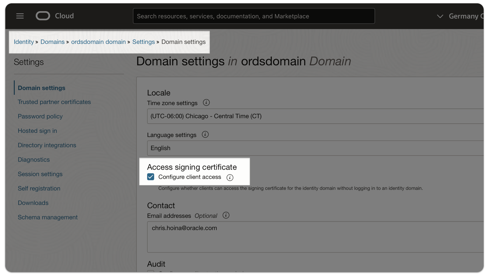
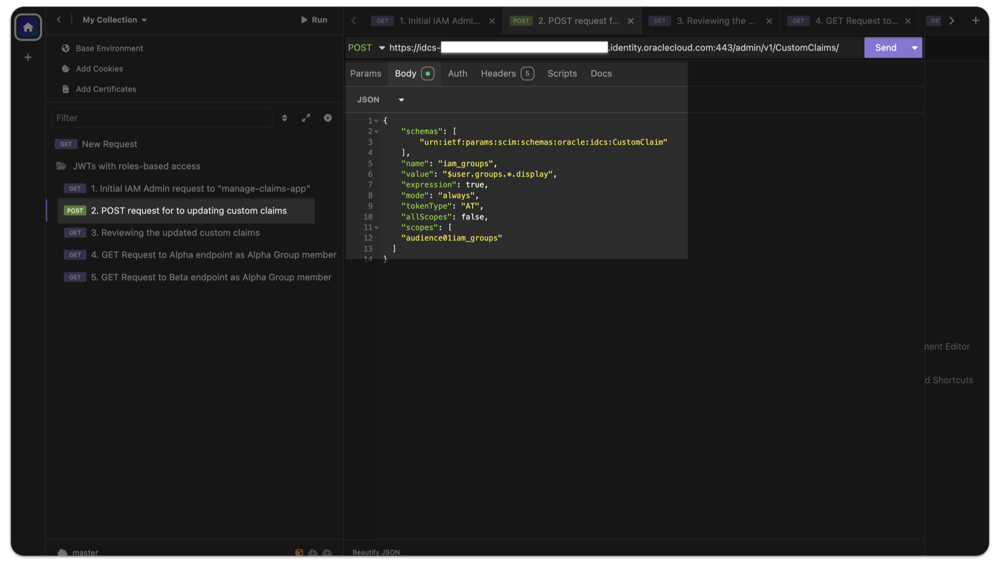
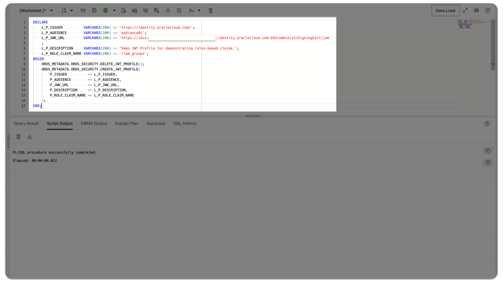
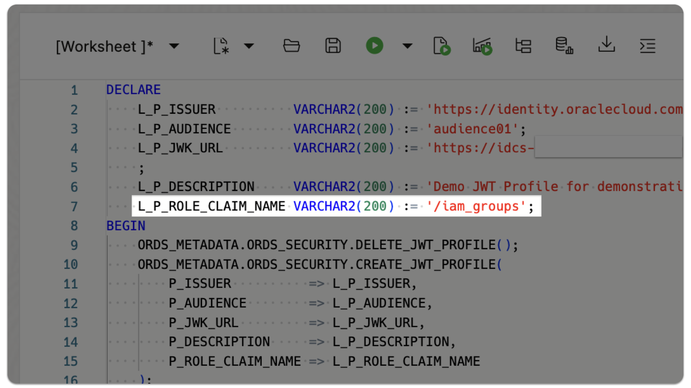
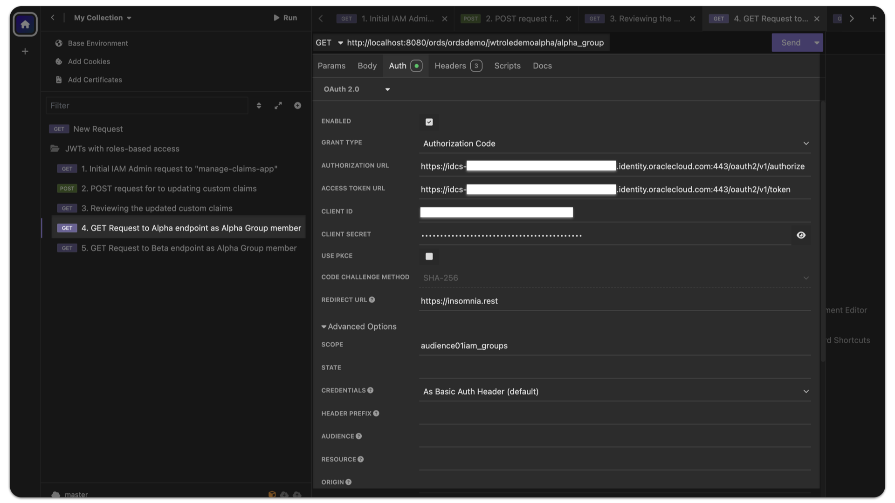
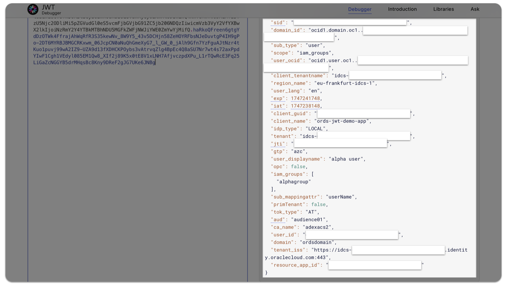
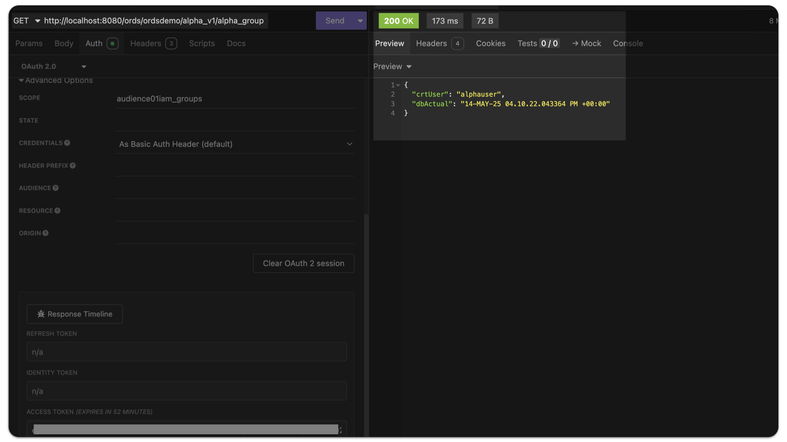
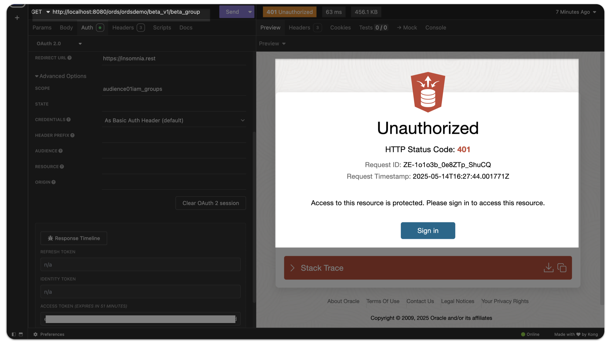

# Configuring Roles-Based Access Claims in OCI Identity and Access Management JSON Web Tokens for accessing OAuth2.0 protected Oracle database REST APIs Part One

## Intro


This tutorial demonstrates the use of Roles-Based Access Control (RBAC) claims in an Oracle Cloud Infrastructure (OCI) Identity and Access Management (IAM) JSON Web Token (JWT) to access Oracle REST Data Services (ORDS) protected resources (i.e., API endpoints).

While in this tutorial, we rely on OCI IAM JWTs, other third-party Identity Providers may differ in their workflows, but there is likely to be considerable overlap and valuable information contained here.  

We provides steps for testing and experimenting with two different use cases:

1. API testing tool example (we use [Insomnia](https://insomnia.rest), an alternative to [Postman](https://www.postman.com))
2. Sample JavaScript single-page web application (using HTML, Node.js and the Express.js framework)

### About ORDS JWT Profiles

ORDS JWT Profiles can be scope-based or role-based. This tutorial demonstrates using an OCI IAM Integrated Application's Groups and its Users as the basis for Role-Based Access. You may optionally use custom User Attributes for your custom claims. This use case is outside the scope of this tutorial, and will be demonstrated in a future publication.

> **About:** [ORDS JWT profiles](https://docs.oracle.com/en/database/oracle/oracle-rest-data-services/25.1/orddg/developing-REST-applications.html#GUID-1E914685-2E05-4380-955D-F8232815E365)
>
> **Note:** Developer resources are provided at the end of this tutorial.

### Prerequisites

The following prerequisites apply to both of the use cases mentioned above. Some degree of experience with the following applications is expected.

1. An existing Identity Domain  

   - This Domain should have the **Configure client access** Domain setting enabled.  

     > **Note:** You can enable this setting from within your Identity Domain's dashboard by navigating to **Settings**, locating the **Access signing certificate** setting, and verifying that the **Configure client access** check box is checked.  

     

2. Integrated Applications

   - You must configure two Integrated Applications in your Identity Domain, one each for:

       1. Creating Custom Claims for your Identity Domain
       2. Your target/demo application  

          > **Note:** Your target application must have at least one Group and one User.

3. An existing 25.1 or later ORDS installation

   - You must configure the following to reproduce this demonstration (see below for included scripts to assist you with this tutorial):

       1. ORDS Roles and Privileges
       2. ORDS JWT Profile
       3. ORDS Resource Module, Template, and Handlers

4. An Oracle database installation; one of:

    - Oracle Autonomous Database (ADB or ATP)
    - Oracle Database 19c or later

5. An Integrated Development Environment capable of installing the required project dependencies via NPM

   - You will need the following packages to follow along:
     - `dotenv`
     - `express`
     - `node-fetch`

   - From within your project root folder, install these packages with the following command:

        ```sh
        npm install express dotenv node-fetch
        ```

### Configuration

Additional configuration will be required in three areas:

  1. Identity Domain
  2. ORDS
  3. IDE/Project Folder

#### Identity Domain

You will need to create and configure two Integrated Applications in your Identity Domain. In this example, we use:

   1. `ords-jwt-demo-app`
   2. `manage-claims-app`

##### Configuring the <code>ords-jwt-demo-app</code> application

This `ords-jwt-demo-app` is a Confidential Application type. The Resource server and Client configuration settings used for this Integrated Application are included for your reference. You may copy these settings to better follow along.

###### Resource server configuration

- **Access token expiration:** `3600` (seconds)  
- **Primary Audience:** `audience01`  
- **Scopes:** `iam_groups`

###### Client configuration

- **Allowed grant types:** `Client credentials`, `JWT assertion`, `Authorization code`, `Implicit`
- **Allow non-HTTPS URLs:** `Enabled`
- **Redirect URL:** `http://localhost:3000/callback` `https://insomnia.rest` `https://oauth.pstmn.io/v1/callback`
- **Client type:** `Confidential`
- **Client IP address:** `Anywhere`
- **Token issuance policy: Authorized resources:** `All`

> **Note:** We use the Authorization code grant type; others are included for convenience.

###### Groups

The `ords-jwt-demo-app` has two Groups:

- `alphagroup`
- `betagroup`

For demonstration purposes, each group will have two users:

- `alphauser`
- `betauser`

In a later section, you will see how these users are mapped to ORDS Roles. Those Roles will then be assigned to ORDS Privileges, which will be used when validating the OCI IAM JSON Web Token.

##### Configuring the <code>manage-claims-app</code> application

You must update the claims in your Identity Domain to include user-created custom claims. Adding these claims will ensure they are included in the JWTs from your Identity Domain.  

You must configure a separate *administrative* Integrated Application (in this example, we create the `manage-claims-app` application for this process) to complete this task. After completing the steps in [this tutorial](https://docs.public.oneportal.content.oci.oraclecloud.com/en-us/iaas/Content/Identity/api-getstarted/OATOAuthClientWebApp.htm), you will be issued an Access Token. You will then use this token to update your Identity Domain's claims to include a new Custom Claim.

Using the Access Token acquired from the tutorial, submit a `POST` request to the `/admin/v1/CustomClaims/` endpoint.

###### Your Custom Claim domain

```sh
https://<domainURL>/admin/v1/CustomClaims/
```

> **Note:** Remove embedded comments in the JSON object below prior to issuing your `POST` request.

###### Example payload included in your `POST` request

```json
{
    "schemas": [
        "urn:ietf:params:scim:schemas:oracle:idcs:CustomClaim"
    ],
    "name": "iam_groups",
    "value": "$user.groups.*.display", // A user expression which returns an array (denoted by the "*") of the sub-attribute "display."
    "expression": true,               
    "mode": "always",                 
    "tokenType": "AT",
    "allScopes": false,
    "scopes": [
    "audience01iam_groups" // A concatenation of the Primary Audience and Scope of your target Integrated Application.
  ]                        
}                          
```

> Learn more: [System for Cross-domain Identity Management (SCIM) specifications](https://www.rfc-editor.org/rfc/rfc7643.html)

###### Sample `curl` command

An example cURL command to your `/admin/v1/CustomClaims/` endpoint (in our demo, we perform this in the Insomnia API testing application).

```sh
curl --request POST \
  --url https://idcs-[Your Identity Doimain Unique Identifier].identity.oraclecloud.com:443/admin/v1/CustomClaims/ \
  --header 'Authorization: Bearer [Your Access Token]' \
  --header 'Content-Type: application/json' \
  --data '{
    "schemas": [
        "urn:ietf:params:scim:schemas:oracle:idcs:CustomClaim"
    ],
    "name": "iam_groups",
    "value": "$user.groups.*.display",     
    "expression": true,
    "mode": "always",
    "tokenType": "AT",
    "allScopes": false,
    "scopes": [
    "audience01iam_groups"
  ]
}'
```



You will receive an `HTTP/1.1 201 Created` response after your `POST` request is complete. You may also issue a subsequent `GET` request to the same endpoint to review these changes.

###### Example `GET` request

```sh
curl --request GET \
  --url https://idcs-[Your Identity Domain Unique Identifier].identity.oraclecloud.com:443/admin/v1/CustomClaims/ \
  --header 'Authorization: Bearer [Your Access Token]' \
```

With the configuration complete, we can configure the ORDS Resource Modules, JWT Profile, Roles, and Privileges.

#### ORDS

You can use the following definitions to reproduce this demonstration.

> **Note:** We assume you have an existing REST-enabled schema.

##### Resource Module

As the user, execute the following PL/SQL Schema import (this can be accomplished via [SQLcl](https://www.oracle.com/database/sqldeveloper/technologies/sqlcl/), [SQL Developer Web](https://docs.oracle.com/en/database/oracle/sql-developer-web/25.1/sdweb/signing-database-actions.html), or [SQL Developer for VS Code](https://www.oracle.com/database/sqldeveloper/vscode/)).

```sql
DECLARE
  l_roles     OWA.VC_ARR;
  l_modules   OWA.VC_ARR;
  l_patterns  OWA.VC_ARR;

BEGIN
  ORDS.DEFINE_MODULE(
      p_module_name    => 'alpha.group.module.v1',
      p_base_path      => '/alpha_v1/',
      p_items_per_page => 25,
      p_status         => 'PUBLISHED',
      p_comments       => NULL);

  ORDS.DEFINE_TEMPLATE(
      p_module_name    => 'alpha.group.module.v1',
      p_pattern        => 'alpha_group',
      p_priority       => 0,
      p_etag_type      => 'HASH',
      p_etag_query     => NULL,
      p_comments       => NULL);

  ORDS.DEFINE_HANDLER(
      p_module_name    => 'alpha.group.module.v1',
      p_pattern        => 'alpha_group',
      p_method         => 'GET',
      p_source_type    => 'plsql/block',
      p_mimes_allowed  => NULL,
      p_comments       => NULL,
      p_source         => 
'DECLARE
    l_date VARCHAR2(100);
    l_user varchar2(100);
    l_status varchar2(100);
BEGIN
    l_user := :current_user;
    SELECT
        SYSTIMESTAMP, :current_user
    INTO l_date, l_user
    FROM
        DUAL;

    :dbActual := l_date;
    :crtUser := l_user;
END;');

  ORDS.DEFINE_PARAMETER(
      p_module_name        => 'alpha.group.module.v1',
      p_pattern            => 'alpha_group',
      p_method             => 'GET',
      p_name               => 'dbActual',
      p_bind_variable_name => 'dbActual',
      p_source_type        => 'RESPONSE',
      p_param_type         => 'STRING',
      p_access_method      => 'OUT',
      p_comments           => NULL);

  ORDS.DEFINE_PARAMETER(
      p_module_name        => 'alpha.group.module.v1',
      p_pattern            => 'alpha_group',
      p_method             => 'GET',
      p_name               => 'crtUser',
      p_bind_variable_name => 'crtUser',
      p_source_type        => 'RESPONSE',
      p_param_type         => 'STRING',
      p_access_method      => 'OUT',
      p_comments           => NULL);

  ORDS.DEFINE_MODULE(
      p_module_name    => 'beta.group.module.v1',
      p_base_path      => '/beta_v1/',
      p_items_per_page => 25,
      p_status         => 'PUBLISHED',
      p_comments       => NULL);

  ORDS.DEFINE_TEMPLATE(
      p_module_name    => 'beta.group.module.v1',
      p_pattern        => 'beta_group',
      p_priority       => 0,
      p_etag_type      => 'HASH',
      p_etag_query     => NULL,
      p_comments       => NULL);

  ORDS.DEFINE_HANDLER(
      p_module_name    => 'beta.group.module.v1',
      p_pattern        => 'beta_group',
      p_method         => 'GET',
      p_source_type    => 'plsql/block',
      p_items_per_page => 25,
      p_mimes_allowed  => NULL,
      p_comments       => NULL,
      p_source         => 
'DECLARE
    l_date VARCHAR2(100);
    l_user varchar2(100);
    l_status varchar2(100);
BEGIN
    l_user := :current_user;
    SELECT
        SYSTIMESTAMP, :current_user
    INTO l_date, l_user
    FROM
        DUAL;

    :dbActual := l_date;
    :crtUser := l_user;
END;');

  ORDS.DEFINE_PARAMETER(
      p_module_name        => 'beta.group.module.v1',
      p_pattern            => 'beta_group',
      p_method             => 'GET',
      p_name               => 'crtUser',
      p_bind_variable_name => 'crtUser',
      p_source_type        => 'RESPONSE',
      p_param_type         => 'STRING',
      p_access_method      => 'OUT',
      p_comments           => NULL);

  ORDS.DEFINE_PARAMETER(
      p_module_name        => 'beta.group.module.v1',
      p_pattern            => 'beta_group',
      p_method             => 'GET',
      p_name               => 'dbActual',
      p_bind_variable_name => 'dbActual',
      p_source_type        => 'RESPONSE',
      p_param_type         => 'STRING',
      p_access_method      => 'OUT',
      p_comments           => NULL);

    
  ORDS.CREATE_ROLE(p_role_name => 'alphagroup');
  ORDS.CREATE_ROLE(p_role_name => 'betagroup');
    
  l_roles(1) := 'alphagroup';
  l_modules(1) := 'alpha.group.module.v1';

  ORDS.DEFINE_PRIVILEGE(
      p_privilege_name => 'alphagroup',
      p_roles          => l_roles,
      p_patterns       => l_patterns,
      p_modules        => l_modules,
      p_label          => 'alphagroup',
      p_description    => 'alphagroup',
      p_comments       => 'alphagroup'); 

  l_roles.DELETE;
  l_modules.DELETE;
  l_patterns.DELETE;
    
  l_roles(1) := 'betagroup';
  l_modules(1) := 'beta.group.module.v1';

  ORDS.DEFINE_PRIVILEGE(
      p_privilege_name => 'betagroup',
      p_roles          => l_roles,
      p_patterns       => l_patterns,
      p_modules        => l_modules,
      p_label          => 'betagroup',
      p_description    => 'betagroup',
      p_comments       => 'betagroup'); 

  l_roles.DELETE;
  l_modules.DELETE;
  l_patterns.DELETE;
    
          
COMMIT;

END;
```

You will now have two Resource Modules:

- `/ords/[Your schema]/alpha_v1/alpha_group`
- `/ords/[Your schema]/beta_v1/beta_group`

In this demonstration, we perform a `GET` request is on each endpoint. The response would include values for the current `SYSTIMESTAMP` and for the ORDS `:current_user` Implicit Parameter.

##### Roles

You will also notice two Roles:

- `alphagroup`
- `betagroup`

##### Privileges

Each Role can then be assigned to an ORDS Privilege. You will now have the following privileges:

- `alphagroup`
- `betagroup`

##### JWT Profile

You must create an ORDS JWT Profile. Each schema may have only one valid JWT Profile at a time. The JWT can be one of:

- Scope-Based Access Control (SBAC)
- Role-Based Access Control (RBAC)

When configuring custom claims in OCI IAM, you may do so with one of two options:

- Identity Domain's User Attributes (additional attributes that you may have created)
- Integrated Application's Groups (and users therein)

This tutorial demonstrates RBAC JWT Profiles using an Integrated Application's Groups. Execute the following PL/SQL procedure to configure your JWT Profile:

```sql
DECLARE
    L_P_ISSUER          VARCHAR2(200) := 'https://identity.oraclecloud.com/'; -- You must include a trailing backslash.
    L_P_AUDIENCE        VARCHAR2(200) := 'audience01';
    L_P_JWK_URL         VARCHAR2(200) := 'https://idcs-[Your Identity Doimain Unique Identifier].identity.oraclecloud.com:443/admin/v1/SigningCert/jwk'
    ;
    L_P_DESCRIPTION     VARCHAR2(200) := 'ORDS RBAC JWTs demonstration';
    L_P_ROLE_CLAIM_NAME VARCHAR2(200) := '/iam_groups'; -- You must include a leading backslash. ORDS will interpret this as a JSON Pointer.
BEGIN
    ORDS_METADATA.ORDS_SECURITY.DELETE_JWT_PROFILE(); -- It is a common best practice to delete an existing JWT Profile and overwrite.
    ORDS_METADATA.ORDS_SECURITY.CREATE_JWT_PROFILE(
        P_ISSUER          => L_P_ISSUER,
        P_AUDIENCE        => L_P_AUDIENCE,
        P_JWK_URL         => L_P_JWK_URL,
        P_DESCRIPTION     => L_P_DESCRIPTION,
        P_ROLE_CLAIM_NAME => L_P_ROLE_CLAIM_NAME
    ); -- Not included here: P_ALLOWED_SKEW and P_ALLOWED_AGE. These are optional parameters; when omitted, their values are set to NULL (i.e., infinity).
END;
```



ORDS will now expect a `stringArray[]` (which was set in the previous OCI IAM custom claims configuration steps) `iam_groups` since the `P_ROLE_CLAIM_NAME` parameter (i.e., JSON Pointer) was used.

> **NOTE:** If no ORDS Role has been assigned to a Privilege, then any authenticated user with the `iam_groups[ ]` claim would be authorized to access one of these protected resources.



> **Important** When an Identity Domain User, who is not assigned to a Group, requests an IAM JWT using the Authorization Code grant type, an empty string would be returned (e.g., `iam_groups " "`) instead of an empty stringArray[ ] (e.g., )`iam_groups[ ]`). Because of this, ORDS 25.1 will not authorize a privileged IAM User, despite having the correct (albeit empty) claim in a JWT. ORDS 25.2 and later will add support for cases where a roles-based claim displays an empty string or empty stringArray[ ].

### Accessing protected ORDS resources

This tutorial provides two examples for demonstrating the OAuth 2.0 Authorization Code Flow method for obtaining a valid JWT (Access Token).

In the first example, we use Insomnia as well as `cURL`. These steps will be similar for Postman and other testing tools.

The second example will demonstrate with a simple single-page web application using JavaScript and Node.js/Express.js.

#### Example 1: Insomnia and <code>cURL</code>

##### Requesting an Authorization Code and Acquiring a JWT

We have configured our Insomnia client with the following values:

- **Grant Type:** `Authorization Code`
- **Authorization URL:** `https://idcs-[Your Identity Domain Unique Identifier].identity.oraclecloud.com:443/oauth2/v1/authorize`
- **Access Token URL:** `https://idcs-[Your Identity Domain Unique Identifier].identity.oraclecloud.com:443/oauth2/v1/token`
- **Client ID:**
- **Client Secret:**
- **Redirect URL:** `https://insomnia.rest`
- **Scope:** `audience01iam_groups`
- **Credentials:** `As Basic Auth Header (default)`



With these values, a `GET` request (i.e., clicking the `Fetch Tokens` button) is sent to the `/oauth2/v1/authorize` endpoint to request an Authorization code.

A new browser window or tab will open, enter the credentials for the Alpha User with:

- **User Name:** `alphauser`
- **Password:** `[Password selected upon creating the alphauser]`

After submitting the user credentials, a `POST` request is sent to the `/oauth2/v1/token` endpoint to both present an Authorization code and exchange it for a valid JWT.

You will be redirected to Insomnia (or other tool used). You may inspect the JWT to review the properties of the JSON payload

##### Inspecting the JWT

You may use your tool of choice for decoding or inspecting a JWT.

> **Optional:** Two freely available options for decoding JWTs are [jwt.io](https://jwt.io) and [jwt.ms](https://jwt.ms).

Notice how the `iam_groups` `stringArray[]` is included in the JWT. ORDS will expect this since it was included as a JSON Pointer in the `CREATE_JWT_PROFILE` PL/SQL procedure.



###### Example JWT

```json
{
  "client_ocid": "ocid1.domainapp.oc1.eu-frankfurt-1.123abc456def789ghi012jkl345mno678pqr901stu234vwx567yz",
  "user_tz": "America/Chicago",
  "sub": "alphauser",
  "user_locale": "en",
  "sidle": 480,
  "idp_name": "UserNamePassword",
  "user.tenant.name": "idcs-[Your unique Tenant Identifier]",
  "idp_guid": "UserNamePassword",
  "amr": [
    "USERNAME_PASSWORD"
  ],
  "iss": "https://identity.oraclecloud.com/",
  "domain_home": "eu-frankfurt-1",
  "ca_ocid": "ocid1.tenancy.oc1..abcdefghijklmnopqrstuvwxyzabcdefghijklmnopqrstuvwxyz",
  "user_tenantname": "idcs-[Your unique Tenant Identifier]",
  "client_id": "ttylsmhrofl123456",
  "sid": "q1w2e3r4t5y6:411abc",
  "domain_id": "ocid1.domain.oc1..abcdefghijklmnopqrstuvwxyzabcdefghijklmnopqrstuvwxyz",
  "sub_type": "user",
  "scope": "iam_groups",
  "user_ocid": "ocid1.user.oc1..aaaaaaaane7pcss3u6urqagkcnkyzp5gdwaehiwilkzsgykhnxagnsiewnuq",
  "client_tenantname": "idcs-[Your unique Tenant Identifier]",
  "region_name": "eu-frankfurt-idcs-1",
  "user_lang": "en",
  "exp": 1747065294,
  "iat": 1747061694,
  "client_guid": "abcdefghijk0123456789",
  "client_name": "ords-jwt-demo-app",
  "idp_type": "LOCAL",
  "tenant": "idcs-[Your unique Tenant Identifier]",
  "jti": "1ab2cd3ef4gh5ij6kl7mn8op9qr",
  "gtp": "azc",
  "user_displayname": "alpha user",
  "opc": false,
  "iam_groups": [
    "alphagroup"
  ],
  "sub_mappingattr": "userName",
  "primTenant": false,
  "tok_type": "AT",
  "aud": "audience01",
  "ca_name": "abcdef1",
  "user_id": "a1b2c3d4e5f6g7h8i9j01k2l3m4n5o6p",
  "domain": "ordsdomain",
  "tenant_iss": "https://idcs-[Your unique Tenant Identifier].identity.oraclecloud.com:443",
  "resource_app_id": "abcdefghijk0123456789"
}
```

We can now test two endpoints to review the expected behavior.

##### Issuing a GET request SUCCESS

We first issue a `GET` request to the `/alpha_v1/alpha_group` endpoint:

###### Success example curl command

```sh
curl --request GET \
  --url http://localhost:8080/ords/ordsdemo/alpha_v1/alpha_group \
  --header 'Authorization: Bearer [Replace with your JWT' \
```

###### Successful response

You should observe the following response:

```sh
HTTP/1.1 200 OK
< Content-Type: text/html;charset=utf-8
< X-ORDS_DEBUG: true
< ETag: " "
< Transfer-Encoding: chunked

{
   "crtUser": "alphauser",
   "dbActual": "14-MAY-25 04.10.22.043364 PM +00:00"
}
```



##### Issuing a GET request FAILURE

You can optionally test the RBAC JWT using the Alpha User and the `/ords/ordsdemo/beta_v1/beta_group` endpoint.

###### Failure example curl command

```sh
curl --request GET \
  --url http://localhost:8080/ords/ordsdemo/beta_v1/beta_group \
  --header 'Authorization: Bearer [Replace with your JWT' \
```

###### Failed response

You will recieve the following response in your console:

```sh
< HTTP/1.1 401 Unauthorized
< Content-Type: text/html
< WWW-Authenticate: Bearer realm="Oracle REST Data Services", error="invalid_token"
< Content-Length: 467009
```

Similarly, in the web browser you should see the following:



## Wrap-up

By now, you should have a better understanding of how to:

1. Create a custom claim from a Group in your Identity Domain's Integrated Application
2. Protect ORDS with a Role that matches a Custom Claim
   - Create the requisite JWT Profile
3. Navigate an OAuth2.0 Authorization Code grant type (for acquiring an OCI IAM JWT) using a testing tool such as Insomnia and `cURL`

In the second part of this tutorial we will demonstrate using OCI IAM RBAC JWTs with ORDS endpoints.

### Resources

The following are helpful resources when working with ORDS and JWTs

- [ORDS and JWT docs](https://docs.oracle.com/en/database/oracle/oracle-rest-data-services/25.1/orddg/developing-REST-applications.html#GUID-B1ED4DFD-9DD4-4FBF-B91D-35373D756538) (ORDS Developer's Guide)
- [Configuring OCI IAM JWTs and ORDS for Scope Based Access Control (SBAC) claims](https://followthecoffee.com/configuring-oci-iam-domain-jwts-to-use-with-ords/) (Blog)
- [Microsoft Entra JWTS with ORDS SBAC claims](https://followthecoffee.com/ords-apis-and-microsoft-entra-jwts-tutorial/) (Blog)
- [ORDS Troubleshooting a 401 invalid_token response](https://followthecoffee.com/401-unauthorized-invalid_token-troubleshooting-oracle-cloud-iam-jwts-with-ords/) (Blog)
- [About ORDS Implicit Parameters](https://docs.oracle.com/en/database/oracle/oracle-rest-data-services/25.1/orddg/implicit-parameters.html)
